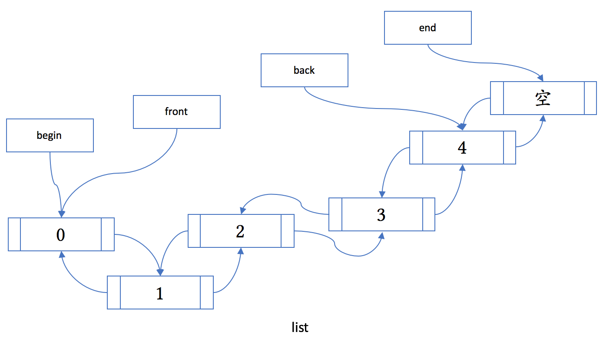

# string

[demo](./06_type_container_string.cpp)
string 支持给期待 const char* 的接口传递字符串内容（使用 c_str）

# array

[demo](./06_type_container_array.cpp)
array是c++ 11新增的序列容器，和其他容器的区别是，array的大小是固定的，无法动态扩展或者收缩。只允许访问或者替换存储的元素。

# vector
布局和array一样，但是大小可以动态变化。

[demo](./06_type_container_vector.cpp)
# deque
双端队列，可以从头尾两端插入或者删除元素。

不支持 data、capacity 和 reserve，因为空间不是连续的。
如果只从头、尾两个位置对 deque 进行增删操作的话，容器里的对象永远不需要移动。
由于元素部分连续，所以遍历性很高的。
如果需要一个经常在头尾增删元素的容器，那 deque 会是个合适的选择。

# list
插入效率o(1)，随机访问效率o(n)
list 不提供 data、capacity 和 reserve 成员函数（和 deque 相同）

排序的话，要使用 list 的成员函数 sort，而不是 std::sort。
此外还有merge、splice、remove、reverse、unique等成员函数。

# forward_list
单向链表，只能从头部插入或者删除元素。

为什么会需要这么一个阉割版的 list 呢？原因是，在元素大小较小的情况下，forward_list 能节约的内存是非常可观的；在列表不长的情况下，不能反向查找也不是个大问题。提高内存利用率，往往就能提高程序性能，更不用说在内存可能不足时的情况了。

# queue & stack
这两个结构c++中也提供了，就是我们常用的队列和栈。他们都是一句现有容器实现的，因此称为容器适配器（container adaptor）。简单来说就是包装了现有容器的一些接口。
他们的push和pop就是算法中的push和pop。

# less & greater

这两个是函数对象，用于比较大小。
[demo](./06_type_container_less_hash.cpp)

# priority_queue
是一个队列。但是他的特点是，队列中的元素是有优先级的，每次取出的元素都是优先级最高的。通过top获取最上面的元素，一般都是最大的元素(less排序)。
这也是一个容器适配器，以其他容器为基础的容器，内部有less函数。
会针对传入的less函数，对元素进行排序。也可以不传，使用默认的less函数。